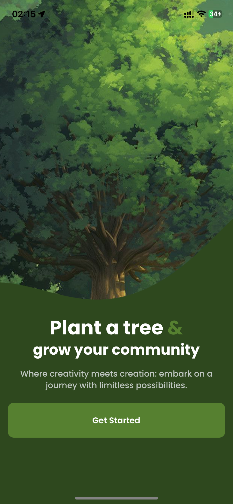
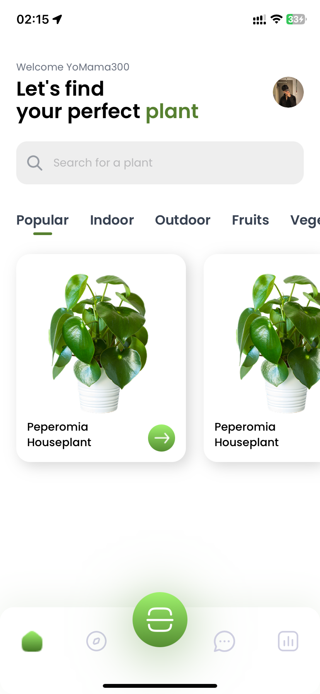
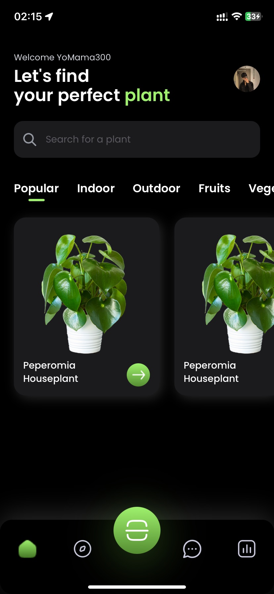

# Planty

Planty is an AI-powered Android and iOS application built with React Native and Expo. It includes image classification to identify plants and a chatbot to provide plant care advice.

## Features
- 🌱 **Plant Identification**: Take a photo of a plant, and the app will classify it.
- 🤖 **AI Chatbot**: Ask plant-related questions and receive AI-powered responses.
- 📱 **Cross-Platform**: Available on both Android and iOS.
- 🔥 **React Native & Supabase**: Uses React Native for the frontend and Supabase for authentication and database.

## Screenshots & Demo (to be listed soon)
<div style="display: flex; flex-wrap: wrap; gap: 10px;">



//
//
</div>


## Installation & Setup

### Prerequisites
- Node.js (Latest LTS recommended)
- Expo CLI
- Android Studio & Xcode (for Android and iOS development)
- Supabase account

### Clone the Repository
```sh
git clone https://github.com/yourusername/planty.git
cd planty
```

### Install Dependencies
```sh
npm install
# or
yarn install
```

### Setting up Supabase
1. Create a Supabase project at [supabase.com](https://supabase.com/)
2. Navigate to **Settings > API** and copy the **Project URL** and **Anon Key**.
3. Set up authentication and database tables for storing user data and plant classification results.

### Environment Variables
Create a `.env.local` file in the root directory and add the following:
```sh
SUPABASE_URL=your-supabase-url
SUPABASE_ANON_KEY=your-supabase-anon-key
OPENAI_API_KEY=your-openai-api-key # If using OpenAI for chatbot
```

### Running the App
```sh
npx expo start
```

## Deployment
### Building for Production
#### Android APK/Bundle
```sh
npx expo export && eas build -p android
```

#### iOS Release
```sh
npx expo export && eas build -p ios
```
