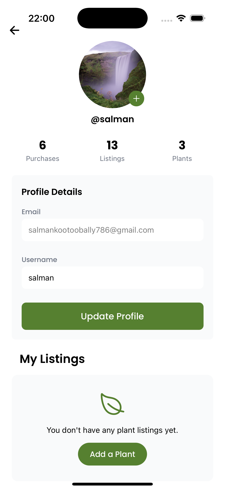
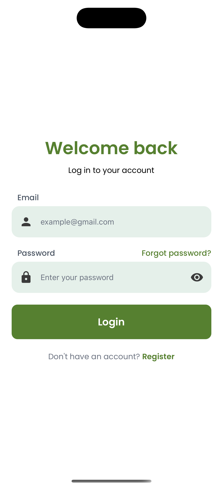
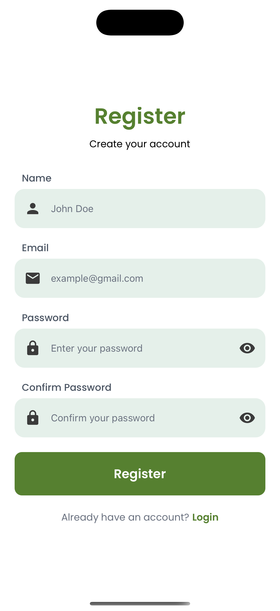
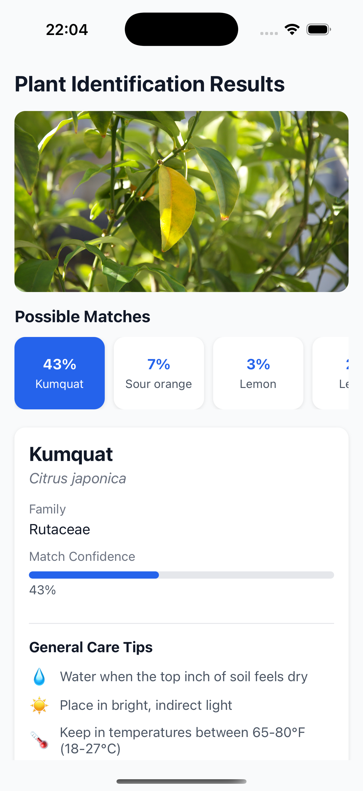
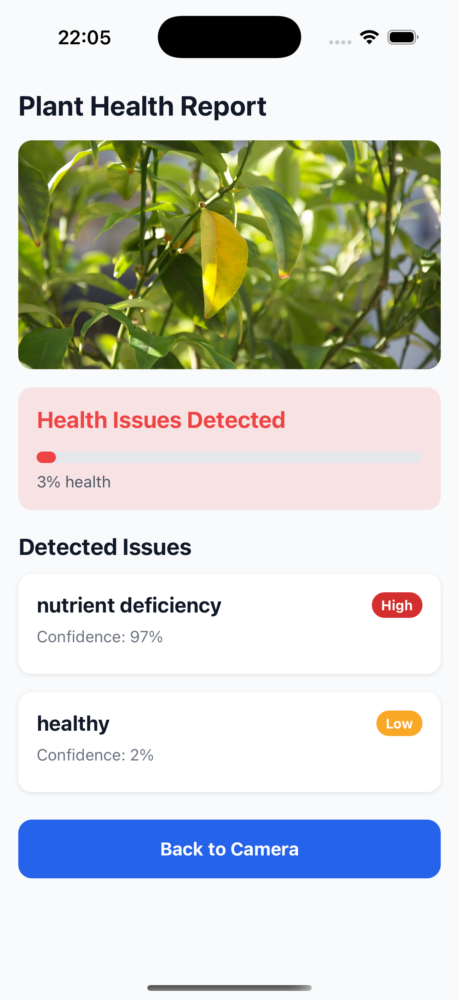
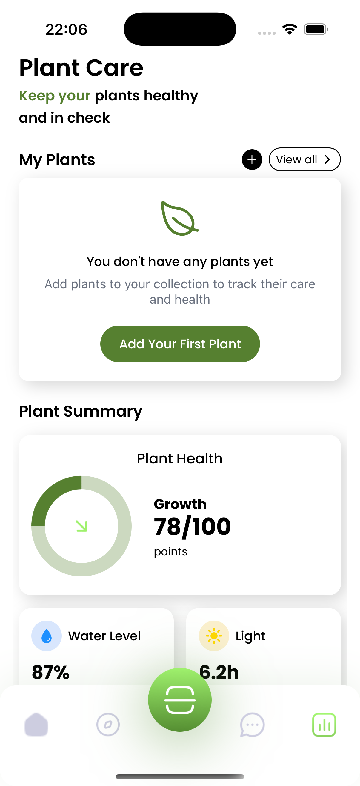
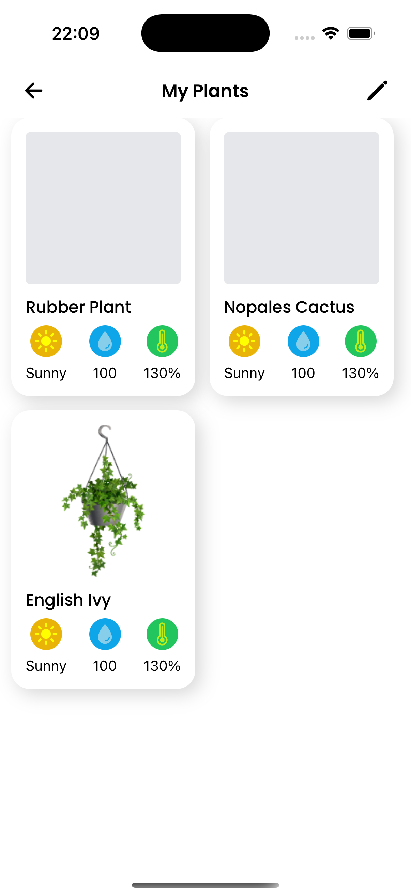
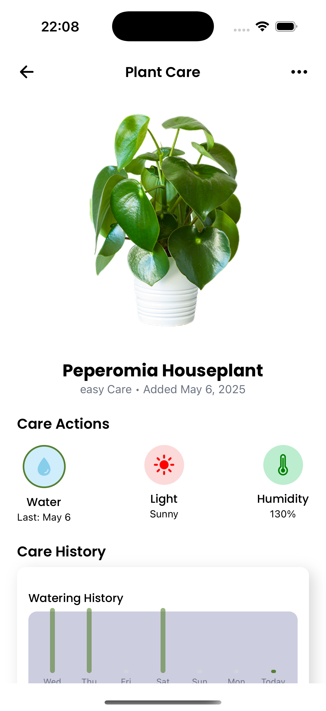
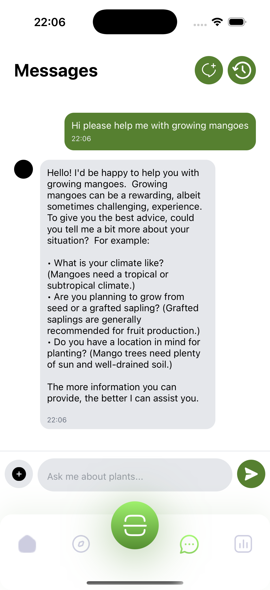

# Planty

Planty is an AI-powered Android and iOS application built with React Native and Expo. It leverages the PlantNet API for plant identification, Google Gemini for AI chatbot, Supabase for backend services, and provides a comprehensive plant care & marketplace experience.

## Features
- 🌱 **Plant Identification**: Take a photo of a plant, and the app will identify it using PlantNet API.
- 🌿 **Plant Health Analysis**: Check if your plant is healthy or has diseases.
- 🔍 **Explore Plants**: Browse and search for plants with advanced filtering options.
- 🪴 **Plant Care**: Track and manage your garden with personalized care instructions.
- 💬 **AI Chatbot**: Ask plant-related questions and receive AI-powered responses.
- 📱 **Cross-Platform**: Available on both Android and iOS.
- 🔥 **Tech Stack**: Built with React Native, Expo, Supabase for authentication and database, and PlantNet API for plant recognition.

## Screenshots

### Onboarding & Home
<div style="display: flex; flex-wrap: wrap; gap: 10px;">
  
  
  
</div>

### Authentication
<div style="display: flex; flex-wrap: wrap; gap: 10px;">
  
  
</div>

### Plant Identification
<div style="display: flex; flex-wrap: wrap; gap: 10px;">
  
  
  
</div>

### Plant Care
<div style="display: flex; flex-wrap: wrap; gap: 10px;">
  
  
  
</div>

### Explore & Shop
<div style="display: flex; flex-wrap: wrap; gap: 10px;">
  
  
  
</div>

### Chat
<div style="display: flex; flex-wrap: wrap; gap: 10px;">
  
</div>


## Installation & Setup

### Prerequisites
- Node.js (Latest LTS recommended)
- Expo CLI
- Android Studio & Xcode (for Android and iOS development)
- Supabase account

### Clone the Repository
```sh
git clone https://github.com/yourusername/planty.git
cd planty
```

### Install Dependencies
```sh
npm install
# or
yarn install
```

### Setting up Supabase
1. Create a Supabase project at [supabase.com](https://supabase.com/)
2. Navigate to **Settings > API** and copy the **Project URL** and **Anon Key**.
3. Set up authentication and database tables for storing user data, plant garden, and identification results.
4. Create the following tables in your Supabase database:
   - `users`: Store user profiles
   - `plants`: Store plant information
   - `user_plants`: Store plants added to user's garden
   - `identification_history`: Store plant identification results

### Environment Variables
Create a `.env.local` file in the root directory and add the following:
```sh
EXPO_PUBLIC_SUPABASE_URL=your-supabase-url
EXPO_PUBLIC_SUPABASE_ANON_KEY=your-supabase-anon-key
EXPO_PUBLIC_PLANT_NET_API_KEY=your-plantnet-api-key
EXPO_PUBLIC_GEMINI_API_KEY=your-openai-api-key # For chatbot functionality
PLANT_NET_API_KEY = "your-plantnet-api-key"
KINDWISE_HEALTH_KEY = "your-kindwise-health-key"
KINDWISE_IDENTIFY_KEY = "your-kindwise-identify-key"
```

### Running the App
```sh
npx expo start
```

## Deployment
### Building for Production

#### Setup EAS Build (for development build)
```sh
npm install -g eas-cli
eas login
eas build:configure
```

#### Android APK/Bundle
```sh
eas build -p android --profile preview
# For production release
eas build -p android --profile production
```

#### iOS Release
```sh
eas build -p ios --profile preview
# For production release
eas build -p ios --profile production
```
